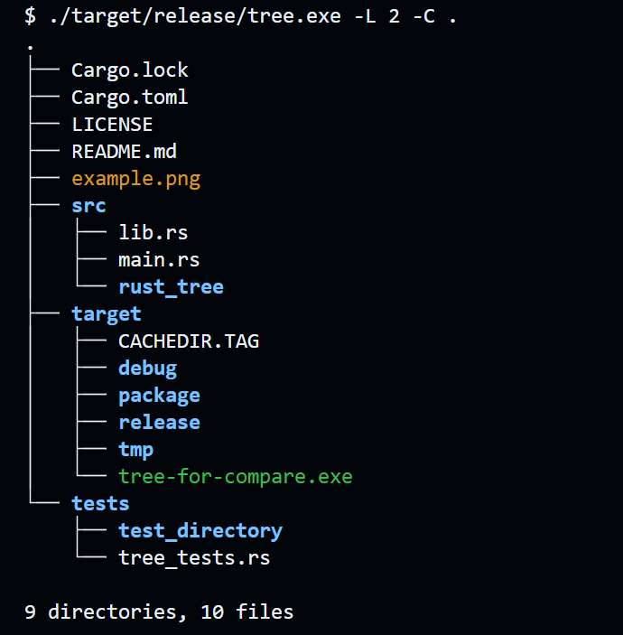

# tree - Cross-Platform tree cli written in Rust

[](https://github.com/peteretelej/tree/releases)
[](https://crates.io/crates/rust_tree)
[](https://github.com/peteretelej/tree/actions/workflows/build.yml)
[](https://github.com/peteretelej/tree/blob/main/LICENSE)

`tree` is an open-source `tree` command-line application that recursively displays the directory structure of a given path in a tree-like format, inspired by the Unix `tree` command. It is implemented in Rust and aims to provide a fast and efficient alternative with additional features, especially useful on platforms with no or limited `tree` cli features. Available for most platforms.

Website: [https://peteretelej.github.io/tree/](https://peteretelej.github.io/tree/)



## Features

- [x] Display directory structure in a tree-like format
- [x] Control the depth of recursion (`-L` or `--level`)
- [x] Show full path (`-f` or `--full-path`)
- [x] No indentation (`-i` or `--no-indent`)
- [x] Display hidden files (`-a` or `--all`)
- [x] Include specific files matching patterns (`-P` or `--pattern`)
- [x] Display the size of each file (`-s` or `--size`)
- [x] Display the total size of each directory (`-H` or `--human-readable`)
- [x] Colorize output (`-C` or `--color`)
- [x] Turn Colorization off (`-n` or `--no-color`)
- [x] Use ASCII characters for tree display (`-A` or `--ascii`)
- [x] List directories only (`-d` or `--directories`)
- [x] Exclude specific files matching patterns (`-I` or `--exclude`)
- [x] Send output to filename with `-o` flag
- [x] Do not descend directories that contain more than # entries with `--filelimit` flag
- [x] List directories first before files with `dirsfirst` flag
- [x] Sort output by last modification time (`-t`)
- [x] Reverse sort order (`-r`)
- [x] Print last modification date (`-D`)
- [x] Append file type indicators (`/`, `*`, etc.) (`-F`)
- [x] Omit summary report (`--noreport`)
- [x] Print permissions (`-p`)

Please feel to open PR requests in case interested in implementing some of the pending features.

## Installation

### Download Binaries

You can easily download binaries for different platforms from the [Releases Page](https://github.com/peteretelej/tree/releases) (Windows, MacOS, Linux).

- Download and unzip for your plaform
- If placing in $PATH, you can rename it to avoid confusing with any other `tree` binaries

### Build from Source

If you have Rust and Cargo installed, you can build the project by running:

```sh
git clone https://github.com/peteretelej/tree.git
cd tree
cargo build --release

./target/release/tree -L 2 .  # or use --level=2
# copy tree binary to a PATH directory
```

The resulting binary will be located at ./target/release/tree.

## Usage

## Usage

```sh
./tree [FLAGS] [OPTIONS] [PATH]
```

For example:

```sh
# Using short flags
./tree -L 2 .
./tree -a -f -s .
./tree -P "*.txt" -I "*.log" .

# Using long flags
./tree --level=2 .
./tree --all --full-path --size .
./tree --pattern="*.txt" --exclude="*.log" .
```

### Using as Rust Crate

```rust
use rust_tree::tree::{list_directory, options::TreeOptions};

fn main() {
    let path = ".";
    let options = TreeOptions {
        full_path: true,
        no_indent: true,
        ..Default::default()
    };
    list_directory(path, &options).unwrap();
}
```

Using the `bytes_to_human_readable` function to print human readable file sizes

```rust
use rust_tree::utils::bytes_to_human_readable;
use std::fs;

fn main() {
    let metadata = fs::metadata("my_file.txt").unwrap();
    let size = metadata.len();
    let size_str = bytes_to_human_readable(size);
    println!("File size: {}", size_str);
}
```

## Development

### Contributing

Contributions are welcome! If you have any suggestions, feature requests, or bug reports, please feel free to open an issue or submit a pull request on the [GitHub repository](https://github.com/peteretelej/tree).

#### Code Formatting

This project uses standard Rust formatting. Before submitting a PR:

```bash
# Format your code
cargo fmt

# Verify formatting
cargo fmt --check
```

#### VS Code Settings

For VS Code users, add this to your settings.json:

```json
{
  "[rust]": {
    "editor.formatOnSave": true,
    "editor.defaultFormatter": "rust-lang.rust-analyzer"
  }
}
```

#### Releasing a new version

<details>
<summary>tree cli Release Process</summary>

Update version in `Cargo.toml` and push a tag:

```bash
# Update version in Cargo.toml to 1.2.3
git add Cargo.toml
git commit -m "version 1.2.3"
git tag -a v1.2.3 -m "tree v1.2.3"
git push origin v1.2.3
```

GitHub Actions will build and publish the release. Visit the [Releases page](https://github.com/peteretelej/tree/releases) to generate automated release notes for the release.

</details>

## License

MIT
